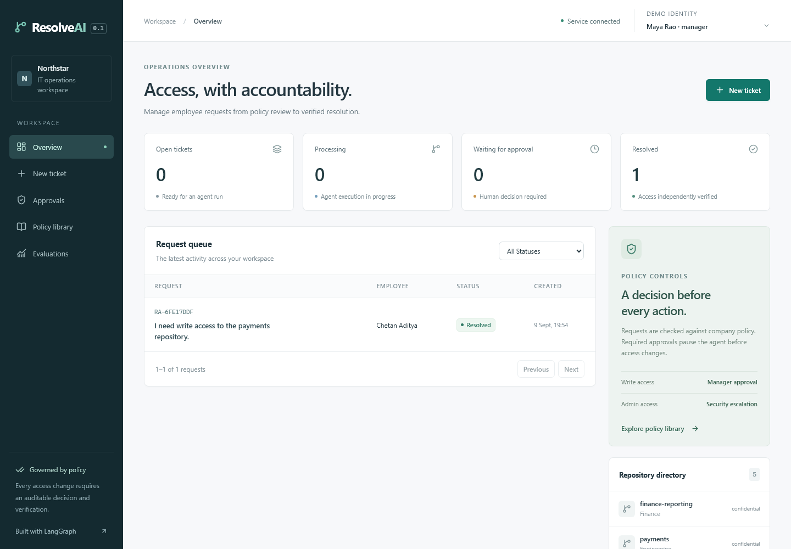
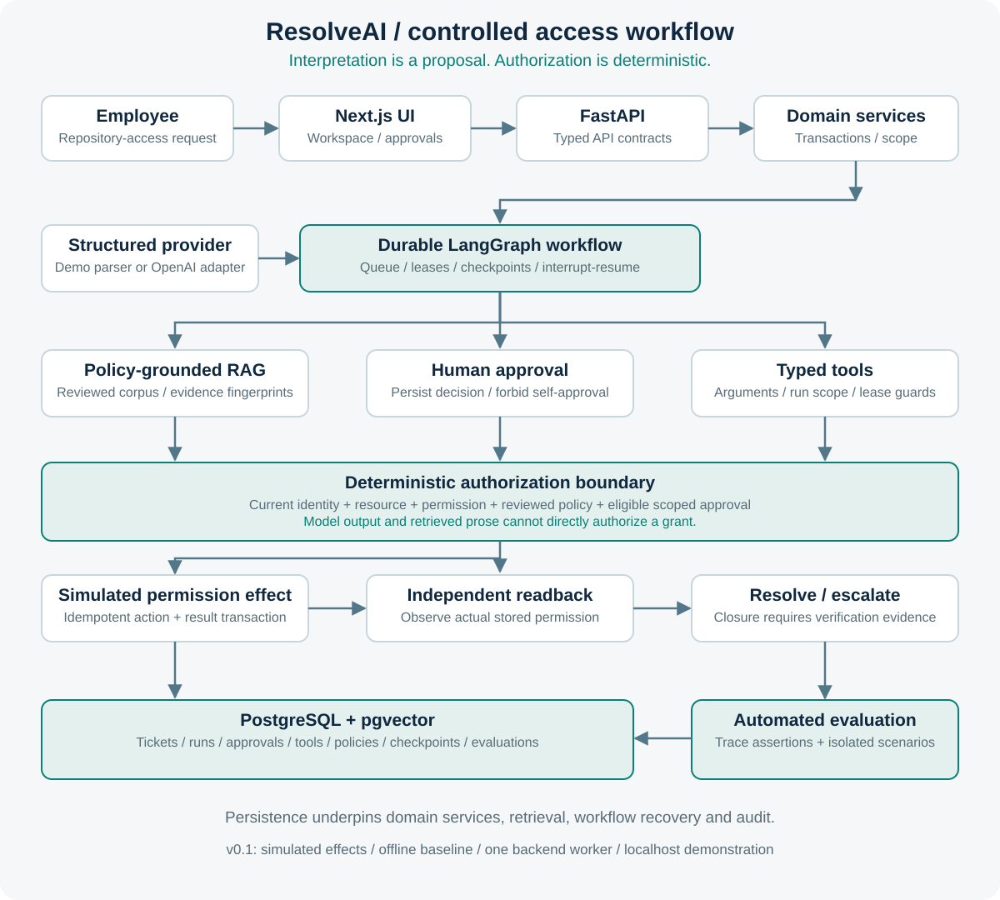

# ResolveAI

### Agentic AI Reliability & IT Access Automation

ResolveAI is a production-style agentic AI system for controlled repository-access automation.
It converts natural-language requests into policy-grounded, observable workflows with durable
human approvals, typed tool execution, independent verification, and automated evaluation.

**The model proposes. Deterministic controls authorize. Observed state determines success.**

[Project case study](https://chetanaditya.netlify.app/projects/resolveai/) ·
[Project overview PDF](ResolveAI-Project-Overview.pdf) · [Local demo](docs/demo.md)



## Why ResolveAI

An LLM response does not prove that the right employee and repository were identified, policy
was followed, an action was approved, or permission actually changed. ResolveAI makes those
checks explicit. Request, run, tool execution, policy evidence, approval, permission effect,
verification, and evaluation are separate persisted records with distinct responsibilities.

This is a bounded repository-access workflow. Permission effects are simulated; the shipped
offline provider is deterministic. The OpenAI adapter exists, but paid live-model behavior
has not been validated. See [limitations](#known-limitations).

## Demo

**Demo video coming soon.** The [case-study demo section](https://chetanaditya.netlify.app/projects/resolveai/#demo)
will host the recording. Until then, use the [five-minute walkthrough](docs/demo.md) and screenshots.
The case study uses one configurable video URL and does not autoplay.

## Example workflow

> I need write access to the payments repository.

1. Ground the requester and repository in stored catalog records; inspect existing access.
2. Retrieve applicable policy evidence and compute the allowed action deterministically.
3. Persist an approval request and pause the LangGraph run at a durable interrupt.
4. An eligible manager approves; the same run resumes and rereads the recorded decision.
5. Revalidate action scope and policy, then execute an idempotent simulated permission change.
6. Read permission independently. Resolve only on matching evidence; otherwise escalate.
7. Evaluate the completed run against recorded identity, policy, approval, tool, and outcome evidence.

Rejection never grants access. Admin requests escalate for security review.

## Architecture



Next.js → FastAPI → domain services → LangGraph, with policy retrieval, persistent approvals,
and typed tools backed by PostgreSQL and pgvector. Retrieved text is evidence, not executable
authorization. The permission service rechecks reviewed policy fingerprints and current facts.

[Architecture and recovery details](docs/architecture.md)

## Core engineering features

- **Durable execution:** persisted run queue, leases, checkpoints, bounded recovery, and replay-safe steps.
- **Human approval:** native LangGraph interrupt/resume; immutable decisions, scoped reviewers, no self-approval.
- **Policy-grounded RAG:** versioned Markdown corpus, section chunks, pgvector ranking, evidence fingerprints.
- **Typed tools:** validated arguments, run scope, node/lease guards, and saved success or failure evidence.
- **Deterministic authorization:** least privilege, no automatic admin grants, fresh checks before mutation.
- **Idempotent actions:** effect and tool result share a transaction in the simulated environment.
- **Independent verification:** a separate permission read is required before verified closure.
- **Failure-safe escalation:** ambiguity, rejection, stale evidence, and mismatches do not become guessed grants.
- **Automated evaluation:** trace assertions and isolated fault scenarios with persisted evaluation results.

## Evaluation

**490 backend tests passed · 12 Chromium tests passed · 37/37 deterministic scenarios passed.**

Fresh local rerun: 9 September 2026, including PostgreSQL/pgvector integration. HTTP restart
recovery and frontend checks passed. Docker Compose configuration passed; Docker execution
could not be reverified because the local engine was unavailable. Exact scope and commands
are recorded in [release validation](docs/release-validation.md).
The versioned catalog contains 37 deterministic scenarios. These exercise grounding, expected and
forbidden tools, approval-before-grant, verification-before-close, escalation, and terminal state.
An evaluator checks observable evidence rather than asking the model to grade its own answer.

A perfect fixed-suite score would not establish general LLM accuracy, semantic retrieval quality,
enterprise security, or universal safety. [Evaluation design](docs/evaluation.md)

## Tech stack

| Area | Implemented technologies |
| --- | --- |
| AI / workflow | LangGraph, structured provider outputs, typed tools, RAG, human approval, evaluation |
| Backend | Python 3.12, FastAPI, Pydantic, SQLAlchemy, Alembic |
| Data | PostgreSQL 16, pgvector; SQLite for isolated tests |
| Frontend | Next.js, React, TypeScript, Tailwind CSS |
| Engineering | Docker Compose, pytest, Ruff, Playwright, GitHub Actions definitions |

## Running locally

Install Docker with Compose, then run from the repository root:

```sh
docker compose up --build
```

Open [the workspace](http://localhost:3000) or [API docs](http://localhost:8000/docs).
Compose runs migrations and seed/policy ingestion before starting the application. Default demo
credentials are for localhost only. The default `demo` parser and `local_hash` lexical embeddings
make no paid API calls. Keep one backend worker process. The database volume survives a normal
`docker compose down`.

For native Python/Node setup, recovery and disposable acceptance checks, see
[deployment](docs/deployment.md) and [frontend setup](frontend/README.md).
Copy `.env.example` to `.env` only when changing local settings; never commit private values.

## Tests

Install Python 3.12 dependencies in a virtual environment:

```sh
python -m pip install -r backend/requirements-dev.lock
python -m pip install --no-deps -e backend
python -m ruff check backend
python -m ruff format --check backend
python -m pytest backend/tests -q
python backend/scripts/smoke_http.py --agent
python -m app.evaluation
```

Set `TEST_DATABASE_URL` to a disposable PostgreSQL/pgvector database to include the integration
test; without it that test is skipped. On Windows an installed PostgreSQL runtime can also be
checked with `python backend/scripts/verify_postgres.py --runtime-dir <runtime-directory>`.

From `frontend/`, with Node.js 22.13 or newer:

```sh
npm ci
npm run lint
npm run format:check
npm run typecheck
npm run build
npx playwright install chromium
npm run test:e2e
```

Browser tests start isolated services on localhost ports 3011 and 8011, using temporary SQLite
databases and offline providers. PostgreSQL behavior is verified separately. CI definitions
cover backend, frontend and Compose acceptance; local success is not a claim of a remote CI run.

## Project structure

```text
backend/                  API, domain services, workflow, tools, RAG, evaluation, tests
frontend/                 Next.js workspace and browser tests
policies/                 Reviewed demonstration policy corpus
docs/                     Technical guides and product screenshots
assets/architecture/      Static architecture diagram
.github/workflows/        Backend, frontend and deployment checks
docker-compose.yml        Local full-stack environment
ResolveAI-Project-Overview.pdf
```

## Known limitations

- Repository permission effects are simulated; there is no production GitHub/Jira integration.
- Demo identity selection is not enterprise SSO. Public route authorization is not production-hardened.
- This is not a public multi-tenant platform or a general-purpose autonomous IT administrator.
- `demo` is a deterministic parser; `local_hash` is a lexical baseline, not semantic embeddings.
- Live paid OpenAI execution remains a separate validation gate.
- Supported execution uses one backend worker. External side-effect reconciliation is future work.
- Evidence is persisted, but is not a cryptographic, tamper-proof audit ledger.

Do not expose the writable demo application publicly. Share the case study, screenshots, and recording.
[Security boundaries](docs/security.md)

## Roadmap

**v0.2:** controlled live-model benchmark, broader language fixtures, semantic embedding comparison,
and measured latency/cost. **v0.3:** GitHub sandbox adapter, external effect reconciliation,
approval expiry, and stronger identity boundaries. Further domains, multi-worker execution,
streaming, and production authentication should follow demonstrated need.

## Documentation

[Public overview PDF](ResolveAI-Project-Overview.pdf) · [Architecture](docs/architecture.md) ·
[Evaluation](docs/evaluation.md) · [Demo](docs/demo.md) · [Deployment](docs/deployment.md) ·
[API contracts](docs/api-contracts.md) · [Database schema](docs/database-schema.md) ·
[Current validation](docs/release-validation.md) · [Changelog](CHANGELOG.md)

## Author

Designed and developed by **Chetan Aditya**.

[Portfolio](https://chetanaditya.netlify.app) · [GitHub](https://github.com/ChetanAditya765) ·
[LinkedIn](https://www.linkedin.com/in/chetan-aditya-02365426a) ·
[Resume](https://chetanaditya.netlify.app/resume.pdf)
