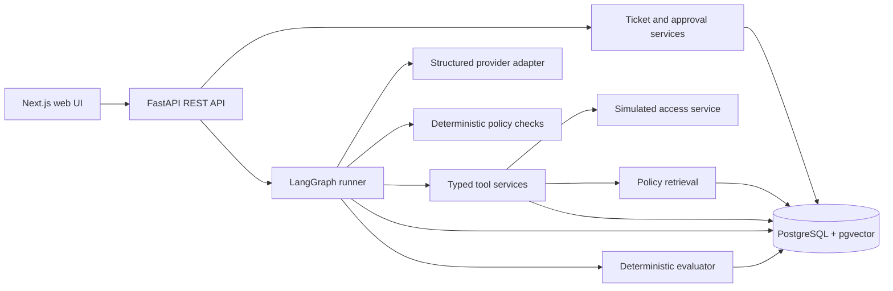
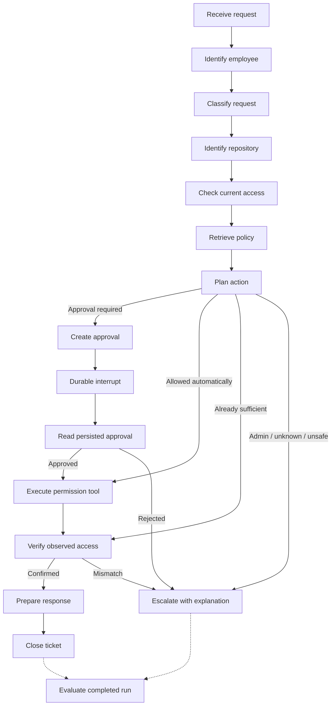

# ResolveAI v0.1 architecture

The v0.1 implementation includes persistence, APIs, provider contracts,
typed tools, durable LangGraph execution, RAG, policy guards, human approval, and verified
simulated access changes, the Next.js product UI, and automated trace/scenario evaluation.

Checkpoint serialization, evaluator version preservation, and HTTP/Compose acceptance tooling
are implemented. See the [current validation record](release-validation.md) and
[deployment runbook](deployment.md) for measured execution scope.



## Deployment and service boundaries

One backend codebase and one backend application process for v0.1; the frontend and PostgreSQL
are the other long-running containers. Migration and seed commands are one-shot Compose jobs.
No broker, Redis, Kafka, or distributed service topology. FastAPI routes validate contracts;
domain services own transactions. Synchronous SQLAlchemy/psycopg calls run in FastAPI's worker
thread pool, using a request-scoped session. A dedicated thread runs the synchronous graph
and provider I/O, using separate sessions for execution and audit transactions.

The implemented worker consumes persisted pending runs and expired leases from PostgreSQL.
Submission commits the run and `PROCESSING` ticket before returning `202`. Transactional
claims use row locks with `SKIP LOCKED`; a lease owner fences subsequent step and tool writes.
Leases refresh at step boundaries. Abandoned runs become recoverable when their lease expires,
with three recovery attempts per execution segment by default before a recorded failure.
Approval decisions begin a new segment; the total attempt counter remains available for audit.
No in-memory background task is the
source of truth. A partial unique index limits a ticket to one active run. The supported v0.1
deployment has one backend worker process; SQLite is an offline adapter with the same single
worker constraint. Human decisions atomically queue the existing interrupted run for resume.

## Explicit workflow

The executable graph starts with:

```text
RECEIVE_REQUEST → IDENTIFY_EMPLOYEE → CLASSIFY_REQUEST → IDENTIFY_RESOURCE
  → CHECK_CURRENT_ACCESS → RETRIEVE_POLICY → PLAN_ACTION
```

Each boundary validates public state and stores its own timeline record. Lookup/classification
failures route directly to escalation. The plan node records a policy-backed decision and
selects an explicit approval, execution, verification, or escalation path. Admin requests
require security review. A completed graph can therefore have ticket status `ESCALATED` and
outcome `escalated`; run completion is distinct from task success. The evaluator runs after
the terminal run transaction commits:



Classification errors, unknown identities, unsupported requests, unavailable policy evidence,
provider timeout, and tool failure route to an explicit error or escalation path. Ambiguity is
recorded as escalation with a clarification request in v0.1; it never causes a guessed grant.

`backend/app/agents/state.py` defines the serializable state and validated nested value models.
State includes schema version, run/ticket/thread IDs, request, intent, identity, resource,
requested/current access, retrieved policy evidence, structured decision summary, planned
tool arguments, approval ID/status, execution result, verification, response, and outcome.
Nested models are serialized with `model_dump(mode="json")` before checkpointing. There is no
field for private chain-of-thought. Node outputs validate these value models at boundaries.
The graph fills retrieved policy evidence, retrieval configuration, approval identity/status,
execution result, and independent verification. New runs use `workflow_version=3`;
historical runs without that field use version 1 and the original seven nodes. Version 2
retains the earlier recommendation-only behavior. The worker restores the run's
provider/model/top-k/threshold before recovery and checks
the retrieval result's identity against it before making a decision.

## Frontend and API boundary

Next.js App Router pages provide the dashboard, new-ticket form, ticket detail, approval
inbox/history, policy library, and evaluation dashboard. Client views poll the REST API, cancel requests on
navigation, and surface failures with retries. All counts, timeline steps, tool results,
and policy excerpts come from persisted backend records. Running steps use progress wording;
verified success comes from the backend's resolved ticket and independent readback.

The server-side `/api/[...path]` proxy uses a configured `BACKEND_URL` origin, allowlisted
path roots, selected headers, no response caching, a timeout, and no followed redirects.
This keeps local and Compose URLs consistent without browser-exposed configuration. The
proxy does not authorize actions: FastAPI validates the demo bearer session and domain scope.

Demo tokens are held in tab-scoped browser storage and revalidated on reload. Switching
identities clears protected approval views before loading the new actor's records. The new
ticket form creates the ticket, then starts its run; a failed second call retries the saved
ticket's run. The UI does not create parallel domain logic or invent fallback state.

The production image contains Next.js standalone output and runs as an unprivileged Node
user. Browser tests run the same standalone server with an isolated SQLite backend and
deterministic providers. PostgreSQL locking/vector behavior is covered separately by the
backend suite. Browser scenarios are implementation tests, separate from the workflow evaluator.

## Model output is a proposal

The provider interface offers typed classification and repository-tool selection. The OpenAI
adapter uses the Responses API with Pydantic structured output and a strict `find_repository`
function call. Scope checks reject changed resources, unknown tool names, or extra arguments;
employee identity comes from the ticket, not model text. Provider/model selection is persisted
per run so restarting with a different default does not silently switch its provider.

The default `demo` provider is explicitly a narrow deterministic request parser, not an LLM.
OpenAI requires explicit configuration and never silently falls back. Its mocked contract
tests cover malformed output, refusal, timeout, and tool-call validation; live paid calls
have not been verified. Provider-specific SDK objects do not cross the interface. Gemini or
Claude can implement the same Pydantic contracts later. Invalid structured output gets one
retry; timeouts and transport failures safely stop rather than retry indefinitely.

The policy service independently computes decisions from catalog facts and verified retrieved
evidence. Access and closure tools recheck them against current database records:

- Admin requests always escalate; manager approval cannot authorize automatic admin grants.
- Write and cross-department requests require approval for the exact employee/resource/level.
- Same-department read may be automatic with applicable retrieved policy evidence.
- Inactive employees and unknown or ambiguous resources cannot receive access.
- Sufficient existing access causes no grant and no downgrade.
- A verified readback is required before reporting success or closing as resolved.

The tool registry exposes employee/repository/permission reads, policy search, approval
creation/status, guarded permission grants, ticket closure, and escalation. Every accepted
execution context records validated arguments and success/failure; employee and ticket
arguments are checked against the owning run. Mutating tools require their designated graph
node and the active execution lease. Model text is never executed
as SQL or accepted as policy authorization.

## Approvals, retries, and audit

LangGraph uses its PostgreSQL checkpointer with a stable `graph_thread_id`. The checkpointer
initializes its own tables in `CHECKPOINT_SCHEMA`, separate from Alembic's domain schema.
An optional `python -m app.agents.checkpoints` command initializes it before traffic; execution
also initializes it automatically. SQLite test checkpoints use a separate configured file.
The worker resumes from the saved graph checkpoint and reuses completed step deltas and tool
results. Tool effect/result transactions and idempotency-key argument checks prevent duplicate
permission changes, closure messages, or escalation messages if a checkpoint write fails
after the domain transaction commits.

The graph uses native `interrupt` and `Command(resume=...)`. Approval creation is a separate
completed node because LangGraph restarts an interrupted node on resume. The worker publishes
`WAITING_FOR_APPROVAL` only after the native interrupt is checkpointed. Reviews before that
point return `409`; recovery can finish publishing a pause without recreating the approval.
The implementation follows the official [interrupt semantics](https://docs.langchain.com/oss/python/langgraph/interrupts)
and [persistence contract](https://docs.langchain.com/oss/python/langgraph/persistence).

The approval schema stores its designated approver, requested employee/resource/permission,
policy snapshot, recommendation, decision actor, time, and optional comment. The service
validates the current actor is the assigned current manager or an active admin, forbids
self-approval, locks the run/ticket/approval rows, and rejects conflicting repeat decisions.
Same-decision retries preserve the original audit record. Resume data is a notification to
reread persisted approval; it is never an authorization token. A changed request requires a
new approval. Approval recording and making the run resumable share one database transaction.

The access tool rechecks identity, policy requirements, existing access, and exact approval
scope immediately before mutation, including the reviewer's current eligibility and the
unchanged policy snapshot. Its idempotency key identifies one action and rejects
reuse with changed arguments. Simulated permission changes and tool-result writes can share a
database transaction. Every attempted tool call has a durable status and redacted arguments;
verification uses a separate read tool invocation. Closure requires the successful verification
tool record, its completed graph step, and matching current permission. A state flag alone
cannot authorize closure or a success response. Rejection escalates without a grant.

Trace endpoints expose selected evidence, short rationale, tool input/output, latency and
final outcome. They never expose hidden reasoning or provider secrets. Active run uniqueness,
foreign keys, and permission uniqueness provide database-level protection alongside services.

## RAG

Eight versioned Markdown sources produce 35 section chunks. Section bodies are bounded at
1800 characters with up to 150 characters of overlap within a long section. The seed command
indexes automatically; the separate ingestion CLI supports reindexing existing sources.
An outer transaction and ingestion savepoint preserve the prior corpus if embeddings or writes
fail. Ordered source row locks coordinate retrieval, seeding, and ingestion.

The configurable embedding interface has a local hash provider (`sha256-lexical-v1`) for an
explicit offline lexical baseline, and an OpenAI provider (`text-embedding-3-small` by default)
for semantic embeddings. The OpenAI adapter checks returned model identity, batch indices,
finite nonzero float32 vectors, dimensions, and errors before storage. Its behavior follows
the [embedding API](https://developers.openai.com/api/docs/guides/embeddings); contract tests
use mocked responses. No paid embedding request has been verified.

PostgreSQL performs top-k cosine ranking using [pgvector's SQLAlchemy integration](https://github.com/pgvector/pgvector-python).
Provider/model filters and optional source slug filters bound the query. SQLite uses an explicit
cosine implementation for offline tests. Before querying, the current small corpus is checked
for complete section coverage, source/chunk hashes, versions, metadata and vector validity.
This deliberately fails closed for partial or mixed indexes. Each result snapshots actual
source/chunk IDs, title, version, section, body, score and document hash. Traces retain evidence
even after a later reindex replaces chunk IDs. Access guards revalidate those IDs and source
content before mutation; finish pending approvals before a forced reindex. Replaced or changed
evidence safely invalidates a pending action rather than authorizing it from a stale snapshot.

The schema fixes 1536 dimensions. Changing dimensions needs migration and reindexing; changing
provider/model requires re-embedding the corpus. Exact search suits 35 chunks, so there is no
approximate vector index. Full-corpus integrity checks must be redesigned for a larger corpus.

Decisions reference retrieved titles and sections. Policy source documents are trusted
application data; employee request text is untrusted. The graph builds its query from catalog
facts, observed access, and applicable rule headings. Deterministic guards then require the
retrieved full section to match a committed manifest of reviewed document/section fingerprints.
Reindexing edited text cannot activate changed authorization rules: rule and manifest changes
need a corresponding code review. Absent, unsupported or inapplicable evidence causes safe
escalation. There is no generic upload or PDF ingestion interface. Read-only policy REST routes
support source inspection and retrieval diagnostics; graph searches use the audited tool.

## Evaluation

The versioned catalog declares initial access, expected outcome/status, required and forbidden
tools, approval requirements, and injected failures. Each case seeds and indexes a fresh SQLite
database and executes the actual worker with demo/local_hash providers. Instance-level tool or
provider overrides inject faults without altering another run's dependencies. The scorer compares
audited tool outputs, policy fingerprints and citations, approval scope and timing, independent
verification, and fixture expectations. It does not call the workflow's decision function.

A manager/admin queues an EvaluationBatch through REST. The existing worker gives queued live
runs priority, then executes one scenario per idle iteration. An application database lease
claims each case; its full trace, score, and batch progress commit atomically. An interrupted case
restarts in fresh isolated state after lease expiry, with three attempts before batch failure.
A unique active slot permits one batch at a time. Submission keys and unique result constraints
prevent duplicate batches/results during retries. No additional service or broker is required.

Each batch also pins its evaluator version. Incompatible unfinished batches stop safely after an
upgrade; historical batch summaries keep their original scores. Current live results are backfilled
under the new scorer version without erasing older results. A no-op grant that preserves sufficient
access supplied by another approved run is evaluated as safe completion, without a downgrade.

Each terminal graph-version-3 live run gets an idempotent evaluation after its completion commit.
Evaluator failure does not undo the ticket result; idle scans retry missing evaluations. Live task
success means verified resolution; scenario task success means expected behavior, including safe
escalation. Live escalation correctness is unavailable without a fixture. Active step latency and
human wait are separate. Scenario traces survive disposal of isolated databases in evaluation
result snapshots. No paid LLM judge is used. See [metric definitions and limits](evaluation.md).

## Identity and deployment scope

The local identity selector issues expiring HMAC-signed bearer sessions. Approval routes reload
the user's role and employee eligibility from the database; a client-supplied role is never
authoritative. A requester can inspect their own approval but cannot decide it. The selector
must be disabled in production, with a private signing key configured. This is a local demo
identity entry point; ticket/catalog routes still need authorization for public deployment.
This is a single-company portfolio application, not a multi-tenant service. Local Compose binds
ports to localhost. Public deployment requires proper credentials, TLS, authentication, and
operational backups; those controls are not claimed complete by the current backend.

## Supported runtime and validation

The supported deployment uses Python 3.12, PostgreSQL 16 with pgvector, the Next.js frontend,
and one backend worker process. SQLite is an isolated test adapter; it does not validate
PostgreSQL locking or pgvector retrieval behavior.

Validation covers persistence and migrations, provider contracts, policy retrieval, approval
pause/resume, scoped tool execution, independent verification, recovery and evaluation.
The [current validation record](release-validation.md) distinguishes successful local checks
from checks that could not run. Docker build, acceptance and container-restart verification
remain pending on a functioning Docker engine; earlier results are not treated as fresh evidence.
